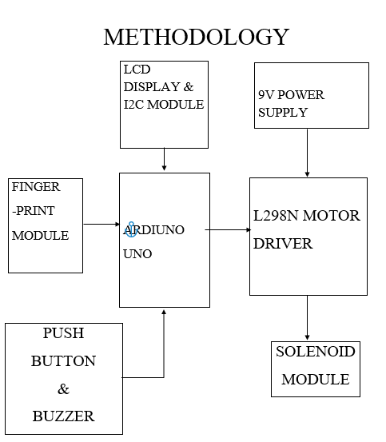
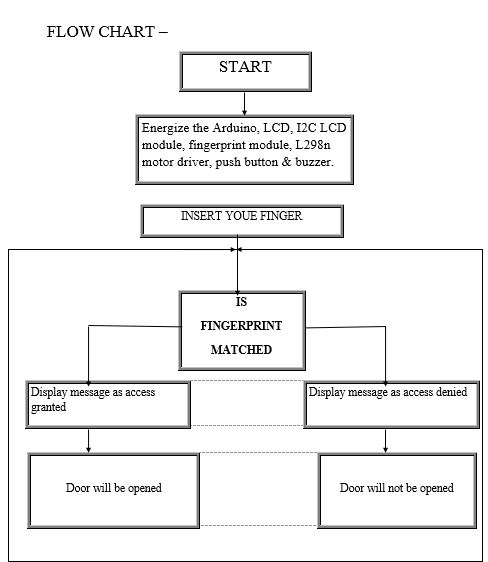
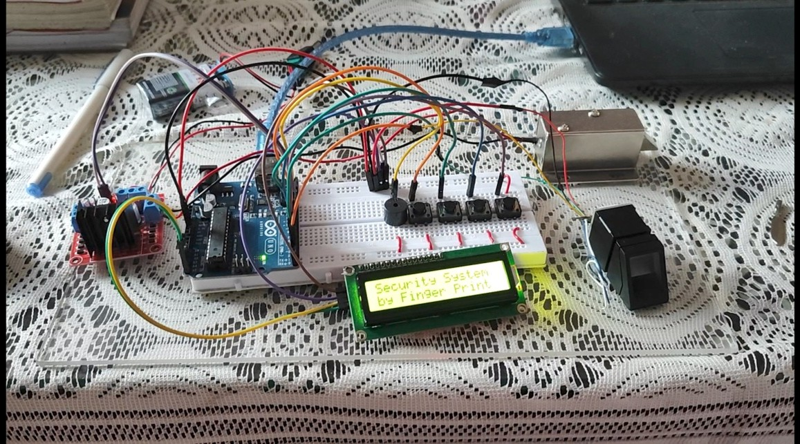

# fingerprint-door-lock-arduino
# Fingerprint Door Lock System using Arduino Uno

## Project Overview
This project is a smart security system that unlocks a door using fingerprint authentication. It uses a solenoid lock controlled via an Arduino Uno.

## Components Used
* Arduino Uno
* Fingerprint Sensor
* LCD Display (I2C)
* Push Button
* Buzzer
* L298N Motor Driver
* Solenoid Lock
* Power Supply

## Arduino Pin Connections

### Fingerprint Sensor
* TX → Pin 2
* RX → Pin 3
* VCC → 5V
* GND → GND
  
### LCD (I2C 16x2)
* SDA → A4
* SCL → A5
* VCC → 5V
* GND → GND

### Buttons
* Enroll → Pin 4 → GND
* Up → Pin 5 → GND
* Down → Pin 6 → GND
* Delete → Pin 7 → GND

Using `INPUT_PULLUP`

### Door Lock (Relay / Solenoid)
* OPEN → Pin 9 → Relay IN
* CLOSE → Pin 8 → Relay IN

### Buzzer
* Pin 13 → Positive
* GND → Negative

### Power Connections
* All VCC → 5V
* All GND → GND

## Code
Code is available in the `.ino` file.

## Applications
* Smart home security
* Office access system
* Locker security

## Circuit Diagram

## Flow Chart

## Setup/Working

![project].(Project Setup using Ardiuno Uno.jpg).
